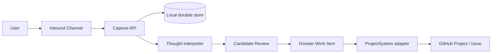

# Architecture Overview

```mermaid
flowchart LR
  User --> Inbound[Inbound Channel]
  Inbound --> API[Capture API]
  API --> Store[(Local durable store)]
  API --> Interpreter[Thought Interpreter]
  Interpreter --> Review[Candidate Review]
  Review --> Work[Domain Work Item]
  Work --> Project[ProjectSystem adapter]
  Project --> GitHub[GitHub Project / Issue]
```
